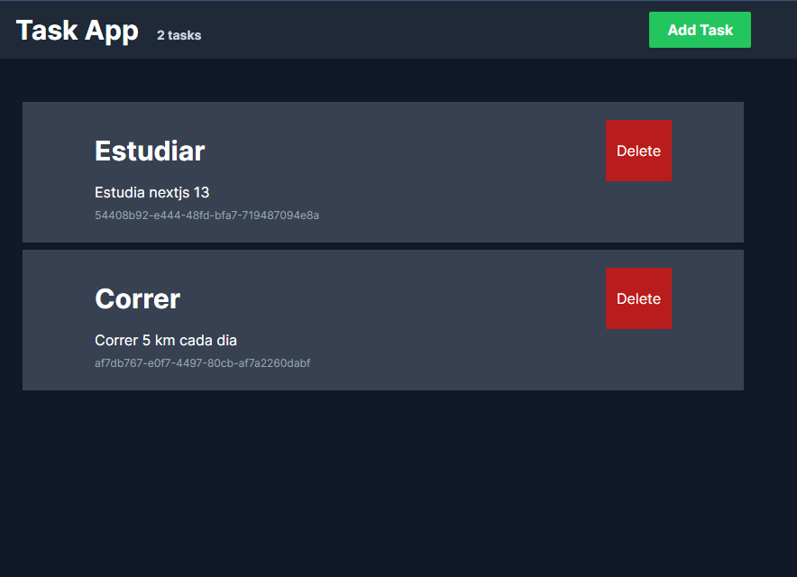

# Nextjs13 CRUD con Localstorage, API Context y TailwindCSS

Thanks to the instructor Fazt!!

https://www.youtube.com/watch?v=Ac9J_yyQqOI



- nextjs-13
- react
- react-hook-form
- react-hot-toast

```
npm run dev
```
